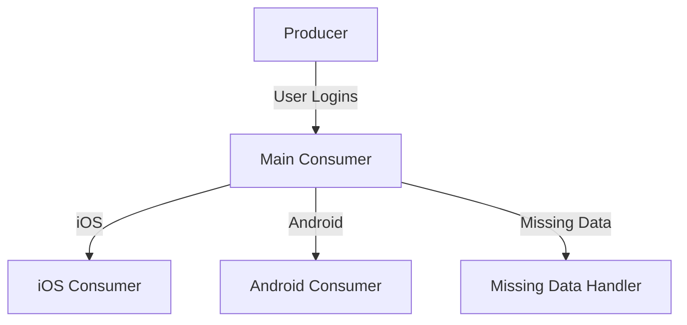

# Real-time User Login Data Pipeline with Kafka

A Kafka-based real-time data pipeline that processes user login events, filters them by platform (iOS/Android), and handles missing data. Built using Python, Docker, and Confluent Kafka.

[](LICENSE)
[](https://www.python.org/)
[](https://kafka.apache.org/)

## Table of Contents
- [FLow Chart] (#flowchart)
- [Features](#features)
- [Prerequisites](#prerequisites)
- [Installation](#installation)
- [Configuration](#configuration)
- [Usage](#usage)
- [Data Flow](#data-flow)
- [Project Structure](#project-structure)
- [Contributing](#contributing)
- [License](#license)


##Flow Chart 


## Features
✔️ Real-time message streaming with Kafka  
✔️ Automated Docker container setup  
✔️ Data filtering by device type (iOS/Android)  
✔️ Missing data handling  
✔️ Multi-topic message routing  

## Prerequisites
- [Python 3.6+](https://www.python.org/)
- [Docker](https://www.docker.com/) v20.10+
- [Docker Compose](https://docs.docker.com/compose/) v1.29+
- [pip](https://pip.pypa.io/en/stable/)

## Installation

1. Clone the repository:
   ```sh
   git clone https://github.com/vijayrampatel/Data-pipeline-Kafka.git
   cd Data-pipeline-Kafka
   ```

2. Install dependencies:
   ```sh
   pip install -r requirements.txt
   ```

## Configuration

### Environment Variables
Create a `.env` file or modify `env.example` with the necessary configurations:

```env
KAFKA_BROKER="localhost:9092"
MAIN_TOPIC="user-logins"
IOS_TOPIC="ios-user-login"
ANDROID_TOPIC="android-user-login"
ERROR_TOPIC="missing-data-login"
```

### Kafka Topics Setup
Ensure Kafka topics are set up correctly:
```sh
docker exec -it kafka kafka-topics --create --bootstrap-server localhost:9092 \
--replication-factor 1 --partitions 1 --topic user-logins
```

## Usage

### Start Kafka Infrastructure
```sh
docker-compose -f docker-compose.yml up -d
```

### Run the Consumers
Run these in separate terminal windows:
```sh
python user-login-consumer.py  # Main consumer
python ios-user-login.py       # iOS-specific consumer
python android-user-login.py   # Android-specific consumer
python missing-data-login.py   # Missing data handler
```

## Data Flow

1. **Producer**: Generates simulated user login events with:
   - User ID
   - Device type
   - Timestamp
   - Location data

2. **Main Consumer (`user-login-consumer.py`)**:
   - Processes raw messages
   - Routes data to appropriate topics:
     - `ios-user-login`
     - `android-user-login`
     - `missing-data-login`

3. **Platform Consumers**:
   - Consume messages from respective topics and display results

### Data Flow Diagram


## Project Structure
```
├── docker-compose.yml          # Kafka/Zookeeper configuration
├── user-login-consumer.py      # Main processing logic
├── ios-user-login.py           # iOS-specific consumer
├── android-user-login.py       # Android-specific consumer
├── missing-data-login.py       # Missing data handler
├── requirements.txt            # Python dependencies
└── README.md                   # Project documentation
```

## Contributing
1. Fork the repository
2. Create your feature branch (`git checkout -b feature/your-feature`)
3. Commit your changes (`git commit -am 'Add some feature'`)
4. Push to the branch (`git push origin feature/your-feature`)
5. Open a Pull Request

## License
This project is licensed under the MIT License - see the [LICENSE](LICENSE) file for details.


